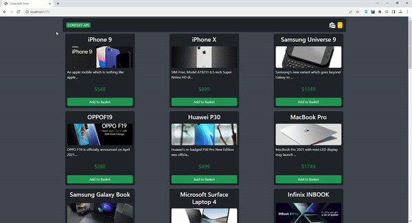

# E-Commerce Website with React and Context API

This is a simple e-commerce website built with React, Axios, and Context API. Users can view a list of products, add them to their basket, and proceed to the basket page to view and manage their selected items.

## Features

- View a list of products with their titles, descriptions, and prices.
- Add products to the basket.
- Remove products from the basket.
- View the total quantity of items in the basket on the header.

## Technologies Used

- React: A JavaScript library for building user interfaces.
- Axios: A promise-based HTTP client for making requests to a REST API.
- Context API: A state management system for managing application-level state.
- Bootstrap: A popular CSS framework for building responsive web designs.
- React Router DOM: A library for adding routing to a React application.

## Usage
Visit the home page to browse available products.
Click the "Add to Basket" button to add a product to your basket.
Click the shopping basket icon in the header to view and manage your basket items.
You can increase or decrease the quantity of items in the basket or remove items altogether.